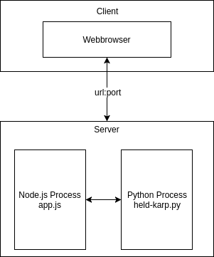

# Traveling Salesman Webapp

This project is a node.js webapp for solving the traveling salesman problem (tsp). <br>
The project uses a modified version of [this](https://github.com/CarlEkerot/held-karp) held-karp algorithm implemantation to solve the tsp. <br>
This readme provides installation instructions and some architectural information, <br>
for anyone who is willing to further develop this project.

This readme has three sections.
1. [Install instructions](#Install instructions).
2. [Software architecture](#Architecture).
3. [Project file structure](Project File Structure).

## 1. Install instructions
To get the project installed you can either use the provided dockerfile,
or you can install node.js/npm on your local machine. 

### Prerequisites
To be able to use the project 
you need to create two google api keys. One for the project frontend and one for the project backend.
Note: If you want to, you can simplify this and use one api key, which has access to all google APIs 
mentioned below.

Frontend key with access to: 
```
- Google Maps Javascript API
```

Backend key with access to: 
```
 - Google Maps Directions API	
 - Google Maps Distance Matrix API	
 - Google Maps Elevation API	
 - Google Maps Geocoding API	
 - Google Maps Embed API	
 - Google Maps Roads API
```
After you created they keys add them to the [Configuration.js](src/Configuration.js)  file.


### Dockerfile
1. Create a docker image with:  ```docker build -t node-tsp .```
2. Run the container with: ```docker run --rm -p 10000:10000 -d node-tsp```

### Manual
1. Install node.js version 8.2.1 (It will probably work with older versions, but I did not test it.)
2. Install npm moduels defined in package.json with:  ```npm install ```
3. Run the app with: ```node app.js```

## 2. Architecture
This section describes the software architecture. The following image <br>
visualizes the core components of the project. <br>




To provide a gui a webserver is realized using node.js as core technolgy.<br>
As serverframework express.js is used.

To interact with the server (GUI) one can acess the configured ```url:port```.<br>
E.g. ```http://localhost:10000/```. 

Locations provided over the GUI are passed to the node.js server. <br>
The server proccesses these locations and creates a distance matrix <br>
of it. This is done by making calls to distance-, geocode- and elevationapi <br>
provided by google. <br>

The created distance matrix is than passed over to a python script <br>
which implements the held-karp algorithm. The python script is called asynchronously as a <br>
child process by the node.js process.

## 3. Project File Structure
This section gives a brief overview about what to find in which folder.
- docu: Place to put in any kind if documentation which is referenced in this readme. Currently only one image.
- held-karp: Python held-karp implemnation taken and slightly modfied from [here](https://github.com/CarlEkerot/held-karp).
- logs: Folder where the node.js expects a logs.txt file to write to it, if something goes wrong.
- public: Folder for static content served by node.js server. (CSS and Javascript files)
- src: Folder where all server code is placed (Except app.js, which acts as the entrypoint).
- views: Folder where the node.js server looks for handlebar views. (Basically here lives the HTML of the frontend)


